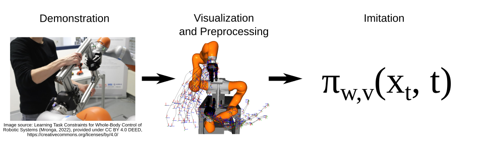

[](https://codecov.io/gh/dfki-ric/movement_primitives)
[](https://doi.org/10.5281/zenodo.6491361)

# Movement Primitives

> Dynamical movement primitives (DMPs), probabilistic movement primitives
> (ProMPs), and spatially coupled bimanual DMPs for imitation learning.

Movement primitives are a common representation of movements in robotics for
imitation learning, reinforcement learning, and black-box optimization of
behaviors. There are many types and variations. The Python library
movement_primitives focuses on imitation learning, generalization, and
adaptation of movement primitives in Cartesian space. It implements dynamical
movement primitives, probabilistic movement primitives, as well as Cartesian
and dual Cartesian movement primitives with coupling terms to constrain
relative movements in bimanual manipulation. They are implemented in Cython to
speed up online execution and batch processing in an offline setting. In
addition, the library provides tools for data analysis and movement evaluation.
It can be installed directly from
[PyPI](https://pypi.org/project/movement-primitives/).



## Content

* [Statement of Need](#statement-of-need)
* [Features](#features)
* [API Documentation](#api-documentation)
* [Install Library](#install-library)
* [Examples](#examples)
* [Build API Documentation](#build-api-documentation)
* [Test](#test)
* [Contributing](#contributing)
* [Non-public Extensions](#non-public-extensions)
* [Related Publications](#related-publications)
* [Funding](#funding)

## Statement of Need

Movement primitives are a common group of policy representations in robotics.
Although movement primitives are limited in their capacity to represent
behavior that takes into account complex sensor data during execution in
comparison to general function approximators such as neural networks, several
instances (e.g., dynamical movement primitives) have proven to be a reliable
and effective tool in robot learning. A reliable tool deserves a similarly
reliable implementation. However, there are only a few actively maintained,
documented, and easy to use implementations. One of these is
movement_primitives.

## Features

* Dynamical Movement Primitives (DMPs) for
    * positions (with fast Runge-Kutta integration)
    * Cartesian position and orientation (with fast Cython implementation)
    * Dual Cartesian position and orientation (with fast Cython implementation)
* Coupling terms for synchronization of position and/or orientation of dual Cartesian DMPs
* Propagation of DMP weight distribution to state space distribution
* Probabilistic Movement Primitives (ProMPs)


Left: Example of dual Cartesian DMP with [RH5 Manus](https://robotik.dfki-bremen.de/en/research/robot-systems/rh5-manus/).
Right: Example of joint space DMP with UR5.

## API Documentation

The API documentation is available
[here](https://dfki-ric.github.io/movement_primitives/).

## Install Library

This library requires Python 3.6 or later and pip is recommended for the
installation. In the following instructions, we assume that the command
`python` refers to Python 3. If you use the system's Python version, you
might have to add the flag `--user` to any installation command.

I recommend to install the library via pip:

```bash
python -m pip install movement_primitives[all]
```

or clone the git repository and install it in editable mode:

```bash
python -m pip install -e .[all]
```

If you don't want to have all dependencies installed, just omit `[all]`.
Alternatively, you can install dependencies with

```bash
python -m pip install -r requirements.txt
```

You could also just build the Cython extension with

```bash
python setup.py build_ext --inplace
```

or install the library with

```bash
python setup.py install
```

## Examples

You will find a lot of examples in the subfolder
[`examples/`](https://github.com/dfki-ric/movement_primitives/tree/main/examples).
Here are just some highlights to showcase the library.

### Potential Field of 2D DMP


A Dynamical Movement Primitive defines a potential field that superimposes
several components: transformation system (goal-directed movement), forcing
term (learned shape), and coupling terms (e.g., obstacle avoidance).

[Script](https://github.com/dfki-ric/movement_primitives/blob/main/examples/plot_dmp_potential_field.py)

### DMP with Final Velocity


Not all DMPs allow a final velocity > 0. In this case we analyze the effect
of changing final velocities in an appropriate variation of the DMP
formulation that allows to set the final velocity.

[Script](https://github.com/dfki-ric/movement_primitives/blob/main/examples/plot_dmp_with_final_velocity.py)

### ProMPs


The LASA Handwriting dataset learned with ProMPs. The dataset consists of
2D handwriting motions. The first and third column of the plot represent
demonstrations and the second and fourth column show the imitated ProMPs
with 1-sigma interval.

[Script](https://github.com/dfki-ric/movement_primitives/blob/main/examples/plot_promp_lasa.py)

### Conditional ProMPs


Probabilistic Movement Primitives (ProMPs) define distributions over
trajectories that can be conditioned on viapoints. In this example, we
plot the resulting posterior distribution after conditioning on varying
start positions.

[Script](https://github.com/dfki-ric/movement_primitives/blob/main/examples/plot_conditional_promp.py)

### Cartesian DMPs


A trajectory is created manually, imitated with a Cartesian DMP, converted
to a joint trajectory by inverse kinematics, and executed with a UR5.

[Script](https://github.com/dfki-ric/movement_primitives/blob/main/examples/vis_cartesian_dmp.py)

### Contextual ProMPs


We use a dataset of [Mronga and Kirchner (2021)](https://doi.org/10.1016/j.robot.2021.103779),
in which a dual-arm robot rotates panels of varying widths. 10 demonstrations
were recorded for 3 different panel widths through kinesthetic teaching.
The panel width is the context over which we generalize with contextual ProMPs.
We learn a joint distribution of contexts and ProMP weights, and then condition
the distribution on the contexts to obtain a ProMP adapted to the context. Each
color in the above visualizations corresponds to a ProMP for a different
context.

[Script](https://github.com/dfki-ric/movement_primitives/blob/main/examples/external_dependencies/vis_contextual_promp_distribution.py)

**Dependencies that are not publicly available:**

* Dataset: panel rotation dataset of
  [Mronga and Kirchner (2021)](https://doi.org/10.1016/j.robot.2021.103779)
* MoCap library
* URDF of dual arm Kuka system from
  [DFKI RIC's HRC lab](https://robotik.dfki-bremen.de/en/research/research-facilities-labs/hrc-lab):
  ```bash
  git clone git@git.hb.dfki.de:models-robots/kuka_lbr.git
  ```

### Dual Cartesian DMP


This library implements specific dual Cartesian DMPs to control dual-arm
robotic systems like humanoid robots.

Scripts: [Open3D](https://github.com/dfki-ric/movement_primitives/blob/main/examples/external_dependencies/vis_solar_panel.py), [PyBullet](https://github.com/dfki-ric/movement_primitives/blob/main/examples/external_dependencies/sim_solar_panel.py)

**Dependencies that are not publicly available:**

* MoCap library
* URDF of [DFKI RIC's RH5 robot](https://www.youtube.com/watch?v=jjGQNstmLvY):
  ```bash
  git clone git@git.hb.dfki.de:models-robots/rh5_models/pybullet-only-arms-urdf.git --recursive
  ```
* URDF of solar panel:
  ```bash
  git clone git@git.hb.dfki.de:models-objects/solar_panels.git
  ```

### Coupled Dual Cartesian DMP


We can introduce a coupling term in a dual Cartesian DMP to constrain the
relative position, orientation, or pose of two end-effectors of a dual-arm
robot.

Scripts: [Open3D](https://github.com/dfki-ric/movement_primitives/blob/main/examples/external_dependencies/vis_cartesian_dual_dmp.py), [PyBullet](https://github.com/dfki-ric/movement_primitives/blob/main/examples/external_dependencies/sim_cartesian_dual_dmp.py)

**Dependencies that are not publicly available:**

* URDF of DFKI RIC's gripper:
  ```bash
  git clone git@git.hb.dfki.de:motto/abstract-urdf-gripper.git --recursive
  ```
* URDF of [DFKI RIC's RH5 robot](https://www.youtube.com/watch?v=jjGQNstmLvY):
  ```bash
  git clone git@git.hb.dfki.de:models-robots/rh5_models/pybullet-only-arms-urdf.git --recursive
  ```

### Propagation of DMP Distribution to State Space


If we have a distribution over DMP parameters, we can propagate them to state
space through an unscented transform.
On the left we see the original demonstration of a dual-arm movement in state
space (two 3D positions and two quaternions) and the distribution of several
DMP weight vectors projected to the state space.
On the right side we see several dual-arm trajectories sampled from the
distribution in state space.

[Script](https://github.com/dfki-ric/movement_primitives/blob/main/examples/external_dependencies/vis_dmp_to_state_variance.py)

**Dependencies that are not publicly available:**

* Dataset: panel rotation dataset of
  [Mronga and Kirchner (2021)](https://doi.org/10.1016/j.robot.2021.103779)
* MoCap library
* URDF of dual arm
  [Kuka system](https://robotik.dfki-bremen.de/en/research/robot-systems/imrk/)
  from
  [DFKI RIC's HRC lab](https://robotik.dfki-bremen.de/en/research/research-facilities-labs/hrc-lab):
  ```bash
  git clone git@git.hb.dfki.de:models-robots/kuka_lbr.git
  ```

## Build API Documentation

You can build an API documentation with sphinx.
You can install all dependencies with

```bash
python -m pip install movement_primitives[doc]
```

... and build the documentation from the folder `doc/` with

```bash
make html
```

It will be located at `doc/build/html/index.html`.

## Test

To run the tests some python libraries are required:

```bash
python -m pip install -e .[test]
```

The tests are located in the folder `test/` and can be executed with:
`python -m pytest`

This command searches for all files with `test` and executes the functions
with `test_*`. You will find a test coverage report at `htmlcov/index.html`.

## Contributing

You can report bugs in the [issue tracker](https://github.com/dfki-ric/movement_primitives/issues).
If you have questions about the software, please use the [discussions
section](https://github.com/dfki-ric/movement_primitives/discussions).
To add new features, documentation, or fix bugs you can open a pull request
on [GitHub](https://github.com/dfki-ric/movement_primitives). Directly pushing
to the main branch is not allowed.

The recommended workflow to add a new feature, add documentation, or fix a bug
is the following:

* Push your changes to a branch (e.g., feature/x, doc/y, or fix/z) of your fork
  of the repository.
* Open a pull request to the main branch of the main repository.

This is a checklist for new features:

- are there unit tests?
- does it have docstrings?
- is it included in the API documentation?
- run flake8 and pylint
- should it be part of the readme?
- should it be included in any example script?

## Non-public Extensions

Scripts from the subfolder `examples/external_dependencies/` require access to
git repositories (URDF files or optional dependencies) and datasets that are
not publicly available. They are available on request (email
alexander.fabisch@dfki.de).

Note that the library does not have any non-public dependencies! They are only
required to run all examples.

### MoCap Library

```bash
# untested: pip install git+https://git.hb.dfki.de/dfki-interaction/mocap.git
git clone git@git.hb.dfki.de:dfki-interaction/mocap.git
cd mocap
python -m pip install -e .
cd ..
```

### Get URDFs

```bash
# RH5
git clone git@git.hb.dfki.de:models-robots/rh5_models/pybullet-only-arms-urdf.git --recursive
# RH5v2
git clone git@git.hb.dfki.de:models-robots/rh5v2_models/pybullet-urdf.git --recursive
# Kuka
git clone git@git.hb.dfki.de:models-robots/kuka_lbr.git
# Solar panel
git clone git@git.hb.dfki.de:models-objects/solar_panels.git
# RH5 Gripper
git clone git@git.hb.dfki.de:motto/abstract-urdf-gripper.git --recursive
```

### Data

I assume that your data is located in the folder `data/` in most scripts.
You should put a symlink there to point to your actual data folder.

## Related Publications

This library implements several types of dynamical movement primitives and
probabilistic movement primitives. These are described in detail in the
following papers.

[1] Ijspeert, A. J., Nakanishi, J., Hoffmann, H., Pastor, P., Schaal, S. (2013).
    Dynamical Movement Primitives: Learning Attractor Models for Motor
    Behaviors, Neural Computation 25 (2), 328-373. DOI: 10.1162/NECO_a_00393,
    https://homes.cs.washington.edu/~todorov/courses/amath579/reading/DynamicPrimitives.pdf

[2] Pastor, P., Hoffmann, H., Asfour, T., Schaal, S. (2009).
    Learning and Generalization of Motor Skills by Learning from Demonstration.
    In 2009 IEEE International Conference on Robotics and Automation,
    (pp. 763-768). DOI: 10.1109/ROBOT.2009.5152385,
    https://h2t.iar.kit.edu/pdf/Pastor2009.pdf

[3] Muelling, K., Kober, J., Kroemer, O., Peters, J. (2013).
    Learning to Select and Generalize Striking Movements in Robot Table Tennis.
    International Journal of Robotics Research 32 (3), 263-279.
    https://www.ias.informatik.tu-darmstadt.de/uploads/Publications/Muelling_IJRR_2013.pdf

[4] Ude, A., Nemec, B., Petric, T., Murimoto, J. (2014).
    Orientation in Cartesian space dynamic movement primitives.
    In IEEE International Conference on Robotics and Automation (ICRA)
    (pp. 2997-3004). DOI: 10.1109/ICRA.2014.6907291,
    https://acat-project.eu/modules/BibtexModule/uploads/PDF/udenemecpetric2014.pdf

[5] Gams, A., Nemec, B., Zlajpah, L., Wächter, M., Asfour, T., Ude, A. (2013).
    Modulation of Motor Primitives using Force Feedback: Interaction with
    the Environment and Bimanual Tasks (2013), In 2013 IEEE/RSJ International
    Conference on Intelligent Robots and Systems (pp. 5629-5635). DOI:
    10.1109/IROS.2013.6697172,
    https://h2t.anthropomatik.kit.edu/pdf/Gams2013.pdf

[6] Vidakovic, J., Jerbic, B., Sekoranja, B., Svaco, M., Suligoj, F. (2019).
    Task Dependent Trajectory Learning from Multiple Demonstrations Using
    Movement Primitives (2019),
    In International Conference on Robotics in Alpe-Adria Danube Region (RAAD)
    (pp. 275-282). DOI: 10.1007/978-3-030-19648-6_32,
    https://link.springer.com/chapter/10.1007/978-3-030-19648-6_32

[7] Paraschos, A., Daniel, C., Peters, J., Neumann, G. (2013).
    Probabilistic movement primitives, In C.J. Burges and L. Bottou and M.
    Welling and Z. Ghahramani and K.Q. Weinberger (Eds.), Advances in Neural
    Information Processing Systems, 26,
    https://papers.nips.cc/paper/2013/file/e53a0a2978c28872a4505bdb51db06dc-Paper.pdf

[8] Maeda, G. J., Neumann, G., Ewerton, M., Lioutikov, R., Kroemer, O.,
    Peters, J. (2017). Probabilistic movement primitives for coordination of
    multiple human–robot collaborative tasks. Autonomous Robots, 41, 593-612.
    DOI: 10.1007/s10514-016-9556-2,
    https://link.springer.com/article/10.1007/s10514-016-9556-2

[9] Paraschos, A., Daniel, C., Peters, J., Neumann, G. (2018).
    Using probabilistic movement primitives in robotics. Autonomous Robots, 42,
    529-551. DOI: 10.1007/s10514-017-9648-7,
    https://www.ias.informatik.tu-darmstadt.de/uploads/Team/AlexandrosParaschos/promps_auro.pdf

[10] Lazaric, A., Ghavamzadeh, M. (2010).
     Bayesian Multi-Task Reinforcement Learning. In Proceedings of the 27th
     International Conference on International Conference on Machine Learning
     (ICML'10) (pp. 599-606). https://hal.inria.fr/inria-00475214/document

## Funding

This library has been developed initially at the
[Robotics Innovation Center](https://robotik.dfki-bremen.de/en/startpage.html)
of the German Research Center for Artificial Intelligence (DFKI GmbH) in
Bremen. At this phase the work was supported through a grant of the German
Federal Ministry of Economic Affairs and Energy (BMWi, FKZ 50 RA 1701).


