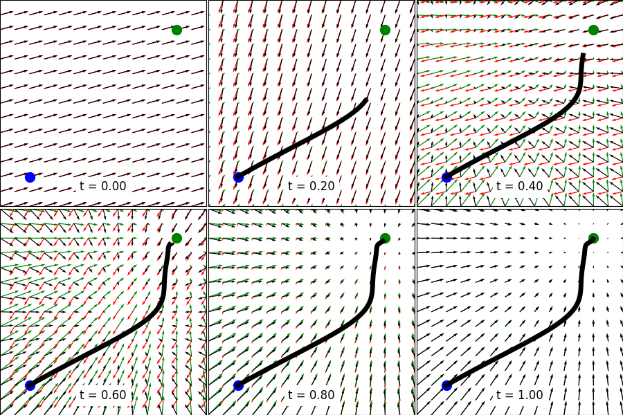

# Movement Primitives

[API Documentation (only reachable within network of DFKI RIC)](http://bob.dfki.uni-bremen.de/apis/dfki-learning/movement_primitives/movement_primitives/)

## Features

* Dynamical Movement Primitives (DMPs) for
    * positions (with fast Runge-Kutta integration)
    * Cartesian position and orientation (with fast Cython implementation)
    * Dual Cartesian position and orientation (with fast Cython implementation)
* Coupling terms for synchronization of position and/or orientation of dual Cartesian DMPs
* Propagation of DMP weight distribution to state space distribution
* Probabilistic Movement Primitives (ProMPs)

## Install Library

This library requires Python 3.6 or later and pip is recommended for the
installation. In the following instructions, we assume that the command
`python` refers to Python 3. If you use the system's Python version, you
might have to add `sudo` in front or the flag `--user` after any installation
command.

I recommend to install the library via pip in editable mode:

```bash
python -m pip install -e .[all]
```

If you don't want to have all dependencies installed, just omit `[all]`.

Alternatively, you can build the Cython extension with

```bash
python setup.py build_ext --inplace
```

or install the library with

```bash
python setup.py install
```

## Non-public Extensions

Note that scripts from the subfolder `scripts/` require access to git
repositories (URDF files or optional dependencies) that are not publicly
available.

### MoCap Library

```bash
# untested: pip install git+https://git.hb.dfki.de/dfki-interaction/mocap.git
git clone git@git.hb.dfki.de:dfki-interaction/mocap.git
cd mocap
python -m pip install -e .
cd ..
```

### Get URDFs

```bash
# UR5
git clone git@git.hb.dfki.de:models-robots/ur5_fts300_2f-140.git
# RH5
git clone git@git.hb.dfki.de:models-robots/rh5_models/pybullet-only-arms-urdf.git --recursive
# RH5v2
git clone git@git.hb.dfki.de:models-robots/rh5v2_models/pybullet-urdf.git --recursive
# Kuka
git clone git@git.hb.dfki.de:models-robots/kuka_lbr.git
# Solar panel
git clone git@git.hb.dfki.de:models-objects/solar_panels.git
# RH5 Gripper
git clone git@git.hb.dfki.de:motto/abstract-urdf-gripper.git --recursive
```

### Data

I assume that your data is located in the folder `data/` in most scripts.
You should put a symlink there to point to your actual data folder.

## Build API Documentation

You can build an API documentation with [pdoc3](https://pdoc3.github.io/pdoc/).
You can install pdoc3 with

```bash
pip install pdoc3
```

... and build the documentation from the main folder with

```bash
pdoc movement_primitives --html
```

It will be located at `html/movement_primitives/index.html`.

## Test

To run the tests some python libraries are required:

```bash
python -m pip install -e .[test]
```

The tests are located in the folder `test/` and can be executed with:
`python -m nose test`

This command searches for all files with `test` and executes the functions with `test_*`.

## Contributing

To add new features, documentation, or fix bugs you can open a pull request.
Directly pushing to the master branch is not allowed.

## Examples

### Contextual ProMPs


[Script](scripts/vis_contextual_promp_distribution.py)

### Conditional ProMPs


[Script](examples/plot_conditional_promp.py)

### Potential Field of 2D DMP



[Script](examples/plot_dmp_potential_field.py)

### Dual Cartesian DMP


Scripts: [Open3D](scripts/vis_solar_panel.py), [PyBullet](scripts/sim_solar_panel.py)

### Coupled Dual Cartesian DMP


Scripts: [Open3D](scripts/vis_cartesian_dual_dmp.py), [PyBullet](scripts/sim_cartesian_dual_dmp.py)

### Propagation of DMP Distribution to State Space


[Script](scripts/vis_dmp_to_state_variance.py)
