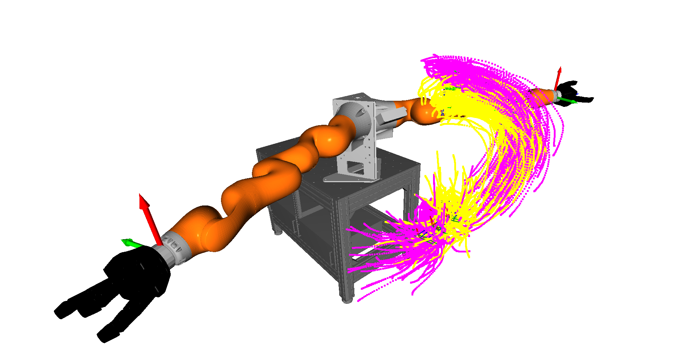
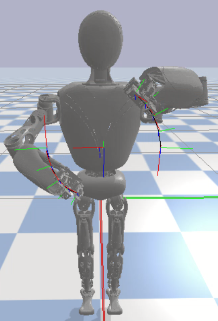
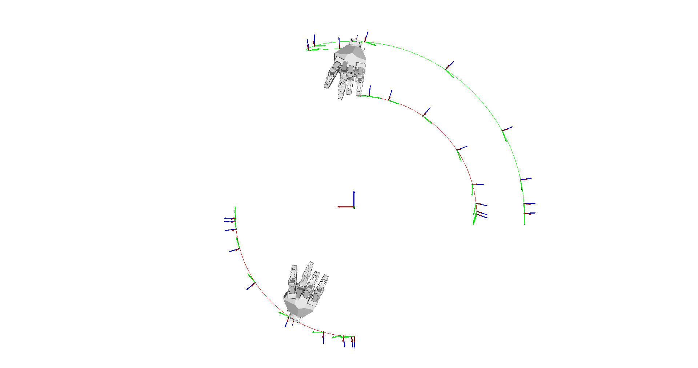

# Movement Primitives

## Features

* Dynamical Movement Primitives (DMPs) for
    * positions (with fast Runge-Kutta integration)
    * Cartesian position and orientation (with fast Cython implementation)
    * Dual Cartesian position and orientation (with fast Cython implementation)
* Coupling terms for synchronization of position and/or orientation of dual Cartesian DMPs
* Propagation of DMP weight distribution to state space distribution
* Probabilistic Movement Primitives (ProMPs)

## Install Dependencies

```bash
# untested: pip install git+https://git.hb.dfki.de/dfki-interaction/mocap.git
git clone git@git.hb.dfki.de:dfki-interaction/mocap.git
cd mocap
pip install -e .
cd ..

# optional: install pytransform3d from source
git clone https://github.com/rock-learning/pytransform3d.git
cd pytransform3d
pip install -e .
cd ..
```

## Install Library

I recommend to install the library via pip in editable mode:

```
pip install -e .[all]
```

If you don't want to have all dependencies installed, just omit `[all]`.

## Get URDFs

```
# UR5
git clone git@git.hb.dfki.de:models-robots/ur5_fts300_2f-140.git

# RH5
git clone git@git.hb.dfki.de:models-robots/rh5_models/pybullet-only-arms-urdf.git --recursive

# Kuka
git clone git@git.hb.dfki.de:models-robots/kuka_lbr.git

# Solar panel
git clone git@git.hb.dfki.de:models-objects/solar_panels.git

# RH5 Gripper
git clone git@git.hb.dfki.de:motto/abstract-urdf-gripper.git --recursive
```

## Optional: Build Cython extensions

```bash
python setup.py build_ext --inplace
```

## Data

I assume that your data is located in the folder `data/` in most scripts.
You should put a symlink there to point to your actual data folder.

## Examples

### Contextual ProMPs




[Script](scripts/vis_contextual_promp_distribution.py)

### Conditional ProMPs


[Script](examples/plot_conditional_promp.py)

### Dual Cartesian DMP




Scripts: [Open3D](scripts/vis_solar_panel.py), [PyBullet](scripts/sim_solar_panel.py)

### Coupled Dual Cartesian DMP




Scripts: [Open3D](scripts/vis_cartesian_dual_dmp.py), [PyBullet](scripts/sim_cartesian_dual_dmp.py)

### Propagation of DMP Distribution to State Space


[Script](scripts/vis_dmp_to_state_variance.py)
